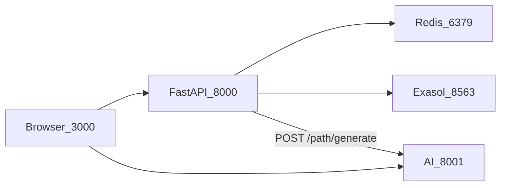
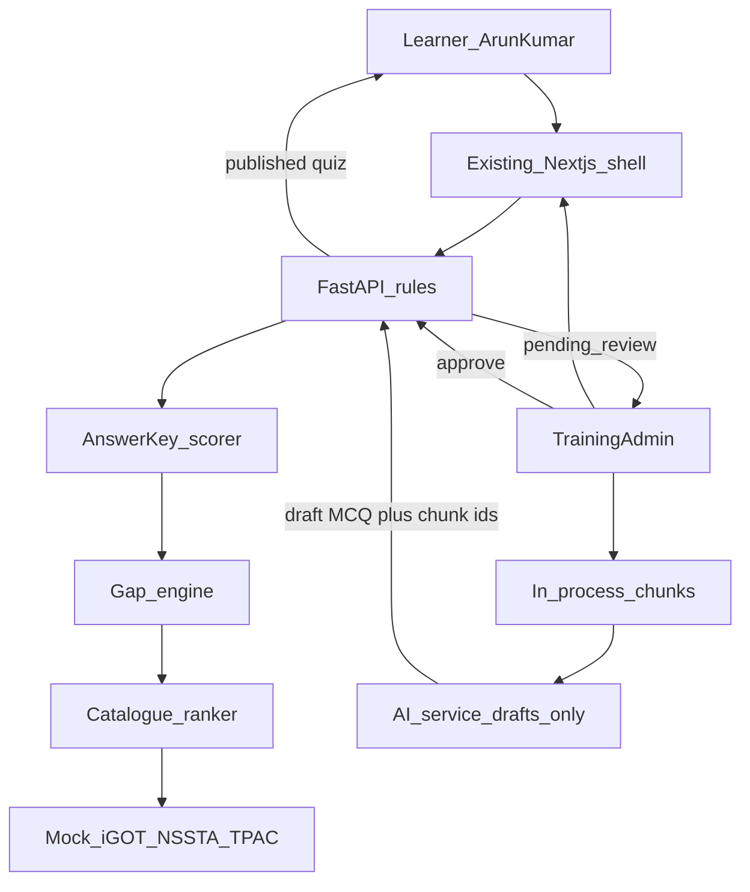
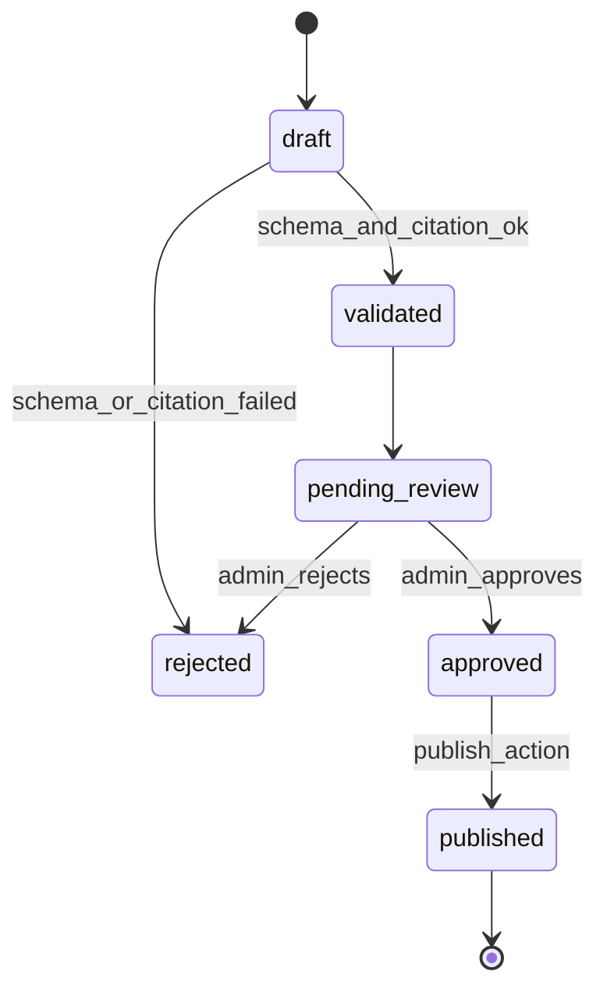

# Architecture

Current system versus the screening-demo target for Why Not 6 (SIH26101). This document describes the boundary. It does not add services or change code.

The screening demo stays on the three processes already in `STAT-Learn/`: Next.js on port 3000, FastAPI on port 8000, AI service on port 8001, with Redis for sessions and cached demo state. Exasol Personal remains the account store when it is connected. A new database, object store, or on-prem model host is not part of the screening architecture.

The pitch deck names PostgreSQL, pgvector, MinIO, Sarvam, and OIDC as the later production shape. Those stay future options. The screening path is an adapter and a rule engine inside the services that already run.

## Current runtime

The browser talks to the backend for auth, paths, nodes, lessons, projects, and the small assessment flow. The lesson page also calls the AI service directly for tutor chat. The only backend-to-AI call today is pathway generation.

Accounts and learners are written to Exasol schema `MANTHAINO` when the database is up, and fall back to process memory otherwise. Paths, skills, courses, and proficiency live in `STAT-Learn/backend/app/repository/mock_db.py` and are snapshotted to Redis. The unused SQL catalogue in `STAT-Learn/infra/exasol/schema.sql` is not what the running routes query.

Scoring today splits into three behaviours:

- `score_answers` in `STAT-Learn/backend/app/services/assessment_scoring.py` compares answers to a fixed Python/SQL key and returns a percentage. The model is not involved.
- Node completion in `STAT-Learn/backend/app/services/progression_service.py` trusts `assessment_score` and `practical_pass` sent by the client.
- Project mentor and several AI tools can supply a score, a pass bit, or a completion. See `STAT-Learn/ai-service/app/tools/registry.py` and the validator defaults in `STAT-Learn/ai-service/app/orchestrator/graph.py`.

There is no upload route, no chunk store, no competency record, and no admin actor.

## Screening target

The learner UI and the admin UI are separate sessions on the same frontend. Scores, gaps, prerequisite checks, and publication state change only inside the backend rule path. The AI service receives document chunks and returns a draft. It does not receive permission to write a competency score or to set an item to published.

### Scoring and gaps

Screening rule, applied in backend code only:

- Each MCQ belongs to exactly one competency, one domain (STAT, TECH, GOV, or BEH), and one level from L1 to L5.
- The answer key is stored on the server. `correct` is 1 when the submitted option matches the key, otherwise 0.
- For a competency, group items by level. A level is met when `correct / attempted >= 0.60` and every lower level is also met. The demonstrated level is the highest met level. If L1 is not met, the demonstrated level is recorded as below L1 and shown as such, not as a model guess.
- The required level comes from the Statistical Officer role profile for that competency.
- Gap = max(0, required level − demonstrated level).
- The explanation lists the competency, required level, per-level correct and attempted counts, the 0.60 threshold, the demonstrated level, the gap, and the missed item ids.

A display paraphrase may be requested from the model only after those fields exist. The stored score and gap remain the arithmetic result. If the paraphrase disagrees with the numbers, the numbers stay.

The same function scores the diagnostic and any quiz published after admin approval. Client-sent scores are ignored for competency updates.

### Prerequisite and pathway checks

A catalogue item is eligible when every prerequisite competency is at or above the prerequisite level in the learner's demonstrated profile. The check is a comparison of stored levels. Unlock explanations stay structured, in the style of `get_lock_explanation` in `STAT-Learn/backend/app/services/unlock_service.py`: a reason code, the current level, and the required level.

Eligible items are ordered by a fixed formula, not by the model:

- larger gap first
- then items whose level is the learner's next level on that competency
- then items whose prerequisites are already met
- source catalogue is a label, not a rank boost

Each recommended row carries `source` = `iGOT`, `NSSTA`, or `TPAC`, plus `synthetic: true`.

### Catalogue adapters

Three adapters share one internal item shape: id, title, short original description, source, domain, competency, level, prerequisites, duration. The screening adapters read seed lists in the backend. They do not call the network.

A later live adapter can implement the same shape. The demo does not include that adapter and must not be described as connected to iGOT or NSSTA.

### MCQ lifecycle

Validation, before any admin button matters:

- stem, at least three options, exactly one keyed option
- domain, competency, and level present and in the allowed sets
- every cited chunk id exists on the uploaded document and the chunk text is non-empty

The model may suggest the keyed option. The stored key used for scoring is the key on the approved record after review. Publishing copies that record into the learner-visible quiz list. Unpublished drafts are invisible to Arun Kumar.

### Retrieval in the screening demo

Upload handling for the demo:

1. Accept one short PDF or text file prepared for the room.
2. Extract text in the backend.
3. Split into chunks with stable ids.
4. Keep chunks in memory or Redis for the demo session.
5. Select chunks for the draft request by lexical overlap with the admin's generation prompt, or by using the full short document when it fits the context.
6. Send those chunks to the AI service.
7. Require the draft to name chunk ids, then join those ids back to chunk text for the admin view.

This is source-grounded generation for a single document. It is not a pgvector index and it is not a search across a government repository.

### What the AI service is allowed to do in the demo

- Draft MCQs as structured JSON from supplied chunks
- Return an explanation string that quotes only fields the backend computed
- Continue to offer a learning-assistance chat if a lesson screen remains in the demo, without a mastery flag that unlocks anything

Provider selection stays in `STAT-Learn/ai-service/app/core/llm.py` (mock, or the configured hosted model). The mock provider must be able to return a valid MCQ draft so the room has a fallback.

## Screens the demo reuses

The visual shell stays: dark sidebar layout, auth screens, and existing page structure. Copy and data change in a later implementation phase. No new visual language.

| Demo beat | Current screen to retarget | File |
| --- | --- | --- |
| Profile and gaps | Dashboard and profile | `STAT-Learn/frontend/src/app/dashboard/page.tsx`, `profile/page.tsx` |
| Pathway | Path | `STAT-Learn/frontend/src/app/path/page.tsx` |
| Diagnostic and published quiz | Assessment | `STAT-Learn/frontend/src/app/assessment/page.tsx` |
| Learning assistance, if shown | Lesson | `STAT-Learn/frontend/src/app/lesson/[id]/page.tsx` |
| Admin upload, evidence, approve | New route on the same shell | not in the repo yet |

The admin route is the one new page the later build adds. It uses the existing layout, tokens, and components. It is not a redesign of the learner screens.

`/workspace`, `/projects`, `/goal`, and `/chat` stay in the tree and stay off the demo script.

## Persistence for the demo

| Data | Where it lives for screening |
| --- | --- |
| Login session | Redis, existing cookie session |
| Arun Kumar and Training Admin accounts | Exasol when connected, otherwise the existing memory fallback |
| Role profile, diagnostic key, catalogue seed, MCQ states, chunk text | Redis or the existing in-memory repository, loaded at startup from demo seed |

Competency truth is whatever the gap engine last wrote. It is not a field on an LLM response.
